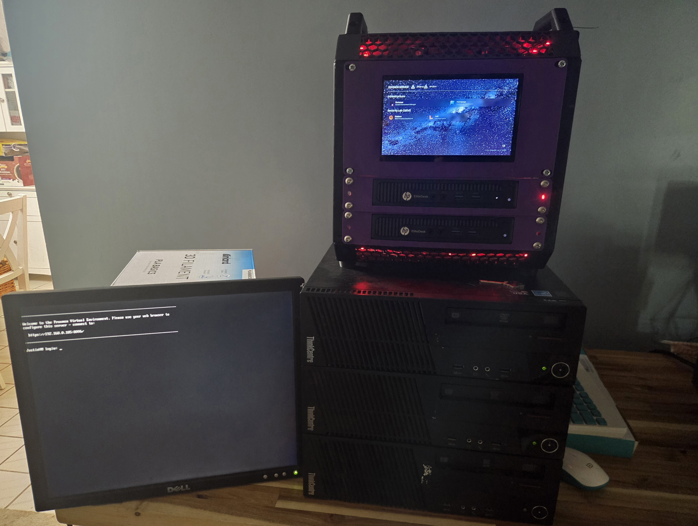

# 5-Node Virtualization & Home Infrastructure Cluster

## Overview
Engineered and deployed a 5-node Debian Linux home lab cluster managed via CasaOS. The architecture enforces strict workload isolation, fixed static IP routing, secure remote management, and real-time observability.

## Architecture & Workload Isolation
* **Node 1 (Media & Knowledge Base):** Immich, Jellyfin, Obsidian sync
* **Node 2 (Networking):** Network routing and traffic management
* **Node 3 (Security & Access):** Dedicated security tools and OpenVPN remote access
* **Node 4 (Observability):** Grafana metrics and system monitoring
* **Node 5 (Game Hosting):** Dedicated NeoForge Minecraft server

## Tech Stack
* **Operating System:** Debian Linux
* **Management UI:** CasaOS
* **Networking & Security:** Static IP Routing, OpenVPN
* **Monitoring:** Grafana
* **Applications:** Immich, Jellyfin, Obsidian, NeoForge
## Screenshots & Architecture Overview
### Physical Hardware Setup

### Cluster Setup & Dashboards

### Services & OS

